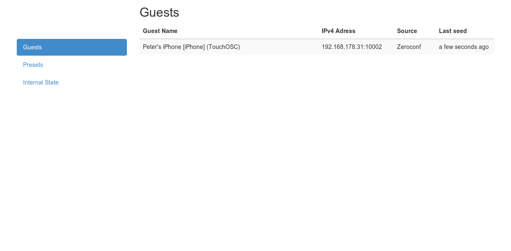
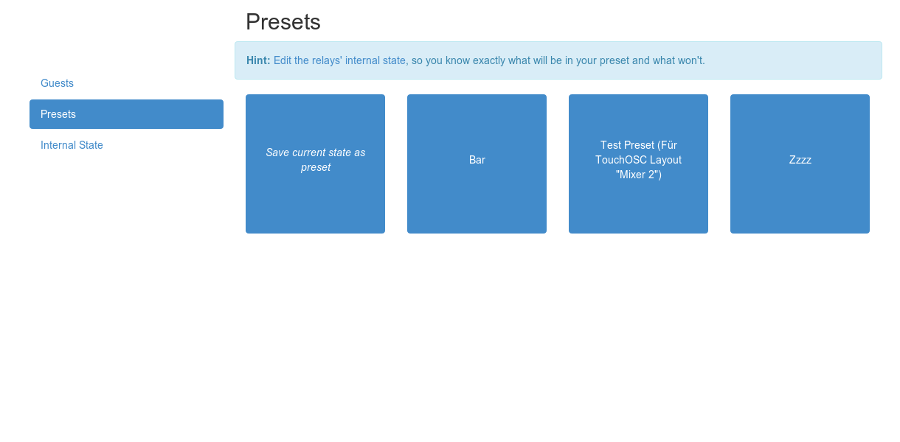
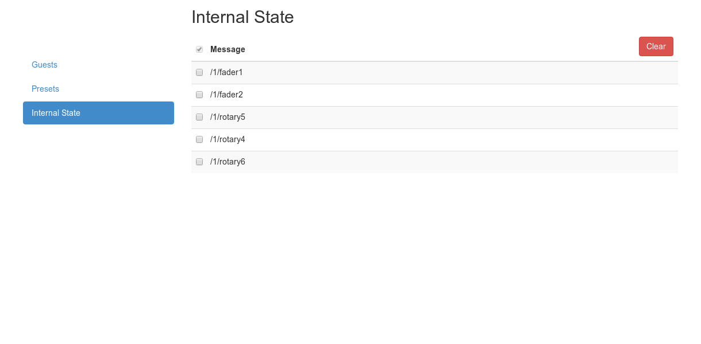
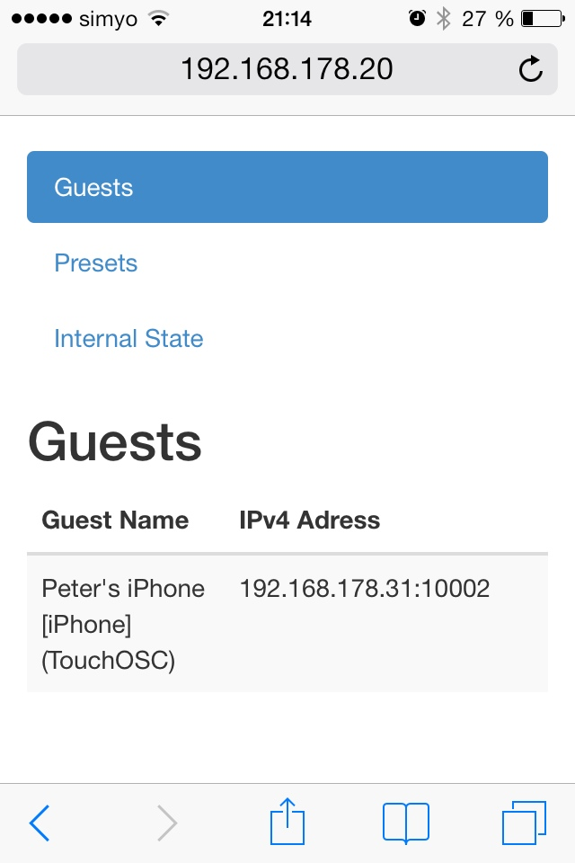
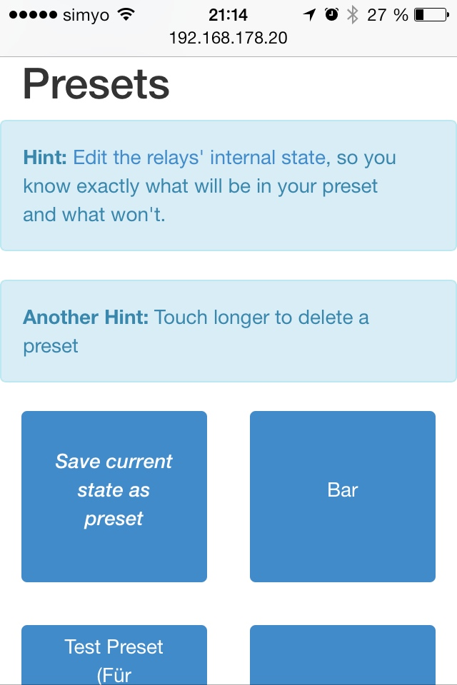

# Stateful OpenSoundControl (OSC) Relay

## About OpenSoundControl
OpenSoundControl (OSC) is a amall and lightweight remote control protocol. I'ts somehow the successor of midi. It consists of messages one device sends to another. For example an iPad with the [TouchOSC](http://hexler.net/software/touchosc) Software can control an [https://www.ableton.com/de/live/ AbletonLive] on your Computer or directly Controle [some Hardware](http://wifimidi.com/). That all works out fine as long as only one Device is controlling one other, but if you have multiple Receivers and multiple Devices you'll need a relay like [Osculator](http://www.osculator.net/).

## About State
But that only solves half of the Problem. If a Device joins the Relay late (ie you change some parameters with TouchOSC from you iPhone and start your iPad afterwards), they will be out of state. The iPad does now know, which value the iPhone has changed previously and there is no way it can query for that information. This Problem shall be solved with the piece of software in front of you.

## About the Stateful OSC Relay
This implementation of an OSC Relay adds some state to the whole OSC chain. It auto-discovers OSC-Compatible devices via [Zeroconf](http://en.wikipedia.org/wiki/Zero-configuration_networking) and briefs them with its own knowledge of the state the whole OSC Network has. Whenever a device sends a message to the relay, the relay stores it into its internal state while at the same time relaying it to all known guest-devices. When a new guest joins, the relay sends it a brief overview of all values in the relays internal state. This way all devices should at all times have the same view on the state of the OSC Network.

## About Zeroconf & Static Guests
Zeroconf is a way to auto-discover devices that offer a specific service such as OSC-Capable devices. If your device or software does not announce itsself als such via Zeroconf, you can configure its adress and port as static guests in the config.js-File. As none-Zeroconf-Devices doesn't announce their availability to the relay, they can't get an automated briefing from it. The relay regularly (default: every 15 minutes) broadcasts its internal state to all staticly configured guests to overcome this.

## About Filters
Some Messages are nonsense. TouchOSC regularly submits a ``/ping``-Message and also transmits a ```/page/[0-9]+``` message each time you switch to another page in the gui. Such messages can be filtered via filter-rules in the configuration.

## About the WebUI
The Relay gives you a Mobile-Compatible Realtime-Web-Gui that gives you insight and control over its operation. You can see all currently connected Receivers ("Guests"), Save and Restore Presets and Manage the internal State of the Relay. If you want another Feature exposed in the WebUI, just drop me a line or -better- [file an Issue](https://github.com/MaZderMind/stateful-osc-relay/issues).







## Getting & Running it
Install [NodeJS](http://nodejs.org/)
Run the following command on the Terminal:
```
wget https://github.com/MaZderMind/stateful-osc-relay/archive/master.zip -O stateful-osc-relay.zip
unzip stateful-osc-relay.zip
cd stateful-osc-relay
npm install
node stateful-osc-relay.js
```
Now the relay should be up and running, announcing itsself via Zeroconf and finding other Devices & Programs that support OSC.

## Example Setup
 The Example-Setup I tested the Relay in is as follows:
 One Mac with the Relay and Osculator on it. Two iOS-Devices with TouchOSC on them. All should work out of the box. Set the Relay as Target in the TouchOSC app. The Relay finds Osculator automatically. Now configure Osculator to do what it's supposed to do.

## Contact
If you have any questions just ask at peter@mazdermind.de or drop me a short line [https://alpha.app.net/MaZderMind](on ADN).
